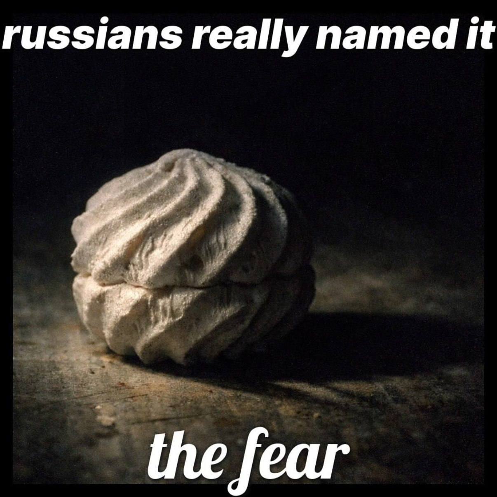

# Лабы по прогре 1 курс:
 
## [9 лаба](https://github.com/burasaki/programming-/tree/main/lab9_git)
## [10 лаба](https://github.com/burasaki/programming-/tree/main/lab10_struct)
## [11 лаба](https://github.com/burasaki/programming-/tree/main/lab11_gdb)
## [12 лаба](https://github.com/burasaki/programming-/tree/main/lab12_libraries)
## [13 лаба](https://github.com/burasaki/programming-/tree/main/lab13_Make_CMake)
## [14 лаба](https://github.com/burasaki/programming-/tree/main/lab14_lists)
## [15 лаба](https://github.com/burasaki/programming-/tree/main/lab15_files)
## [16 лаба](https://github.com/burasaki/programming-/tree/main/lab16_threads)
## [лаба debug](https://github.com/burasaki/programming-/tree/main/lab_debug)
## [17 лаба](https://github.com/burasaki/programming-/tree/main/lab17_test)
## [18 лаба](https://github.com/burasaki/programming-/tree/main/lab18_cpp)

