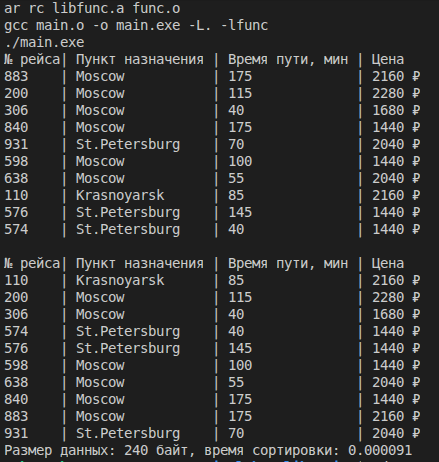

#Библиотеки

## Вариант структуры Авиарейс:
- Номер рейса
- Пункт назначения
- Время в пути (мин)
- Цена билета

## Реализован [колбек](func.c#L44) в сортировке

## [main.c](main.c) содержит вызовы функций
## [func.c](func.c) реализация всех функций
## [flight.h](flight.h) заголовочный файл
## [Makefile](Makefile) для сборки

## Для запуска введите `make run`

