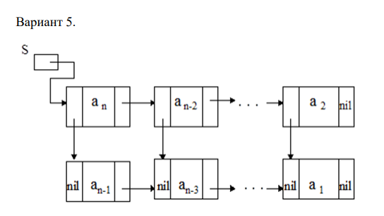
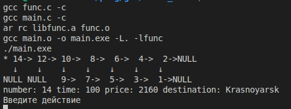

# Lists


## Вариант 5


## [main.c](main.c) содержит вызовы функций
## [func.c](func.c) реализация всех функций
## [flight.h](flight.h) заголовочный файл
## [Makefile](Makefile) для сборки

### Для запуска ввести
``` bash
make run
```
### Для перемешения использовать s(start вернуться в начало), r (right перейти к правому элементу), d (down перейти к нижнему элементу), q (quit завершить программу)


#### Звёздочкой "*" обозначается элемент на котором находится указатель