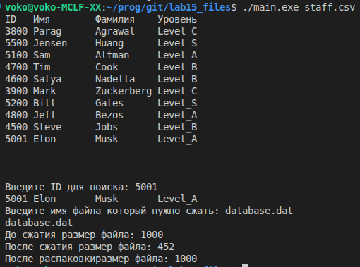

# Files


## [main.c](main.c) содержит вызовы функций
## [func.c](func.c) реализация всех функций
## [staff.h](staff.h) заголовочный файл
## [staff.csv](staff.csv) база данных
## [Makefile](Makefile) для сборки

### Для запуска ввести
``` bash
make; ./main.exe <db_name>
```

