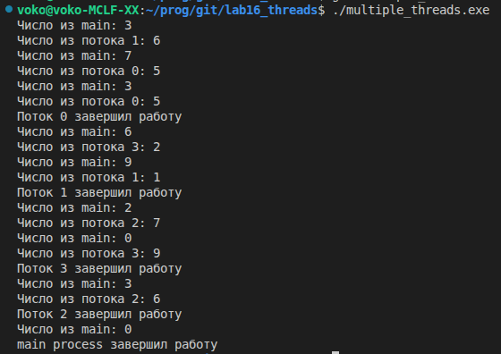
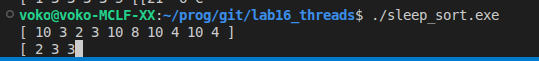
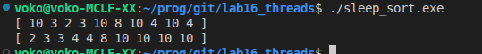
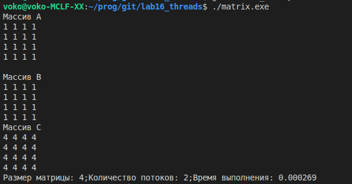
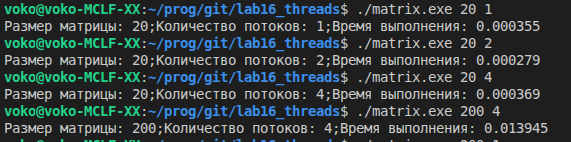
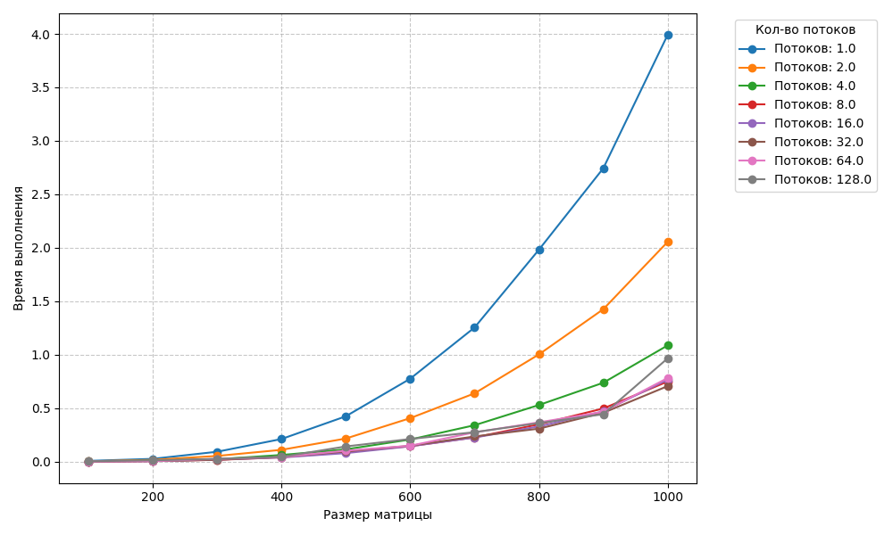
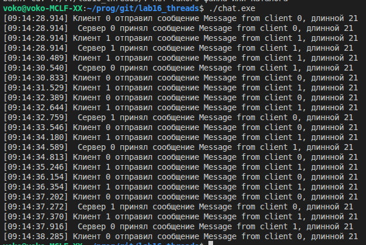

# Threads

## [multiple_threads.c](multiple_threads.c) Последовательно выводит строки из родительского и дочерних потоков

 

 ## [sleep_sort.c](sleep_sort.c) Сортировка Sleepsort
 
 

 ## [multiple_threads.c](multiple_threads.c) Перемножение матриц

  
  
  

## [chat.c](chat.c) Простой односторонний чат где сервера постоянно принимают сообщения от клиентов и выводят их на
экран в формате а клиенты постоянно пытаются отправить сообщения серверам.

