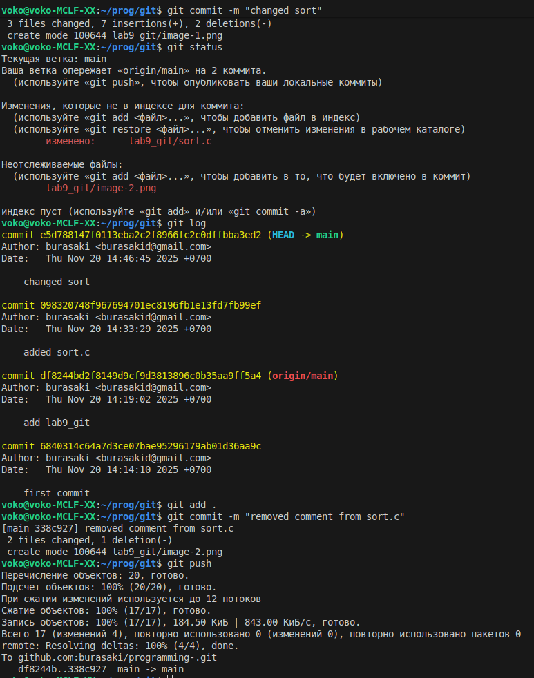
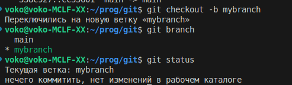
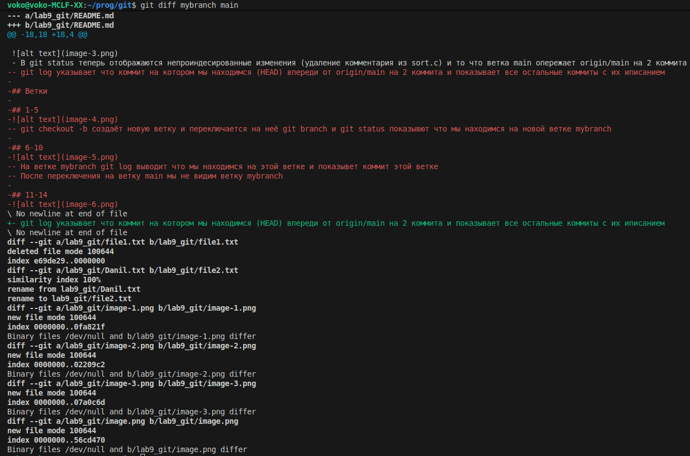

# Оценка 3
## 1-4

- Git log показывает начальный коммит и
 коммит с добавлением папки lab9_git
- После добавления файла sort.c он начал отображаться в git status как не отслеживаемый
## 5-8

- после добавления файла в stage git status указывает файлы которые будут добавлены в следующий коммит
- после коммита git status указывает что нечего коммитить, нет изменений, следует сделать push

## 9-12

- После добавления коментария git на не проиндесированные изменения
- После добавления указывает файлы которые будут добавлены в следующий коммит

## 13-17

- В git status теперь отображаются непроиндесированные изменения (удаление комментария из sort.c) и то что ветка main опережает origin/main на 2 коммита
- git log указывает что коммит на котором мы находимся (HEAD) впереди от origin/main на 2 коммита и показывает все остальные коммиты с их иписанием

## Ветки

## 1-5

- git checkout -b создаёт новую ветку и переключается на неё git branch и git status показывют что мы находимся на новой ветке mybranch

## 6-10

- На ветке mybranch git log выводит что мы находимся на этой ветке и показывет коммит этой ветке
- После переключения на ветку main мы не видим ветку mybranch

## 11-14

- Файл file2.txt не пропал, а остался в ветке master

## 15-17

- git diff показал разницу между двумя ветками, в одной есть файл file1.txt в другой file2.txt и разницу между README.md (т.к его я писал во время выполнения:) )