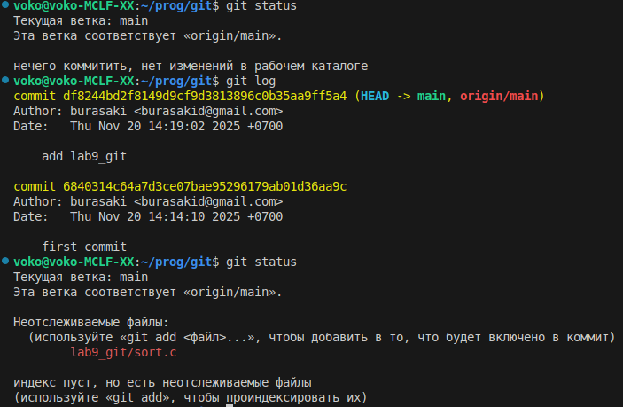
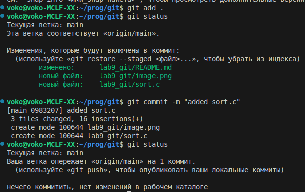

## 1-4

- Git log показывает начальный коммит и
 коммит с добавлением папки lab9_git
- После добавления файла sort.c он начал отображаться в git status как не отслеживаемый
## 5-8

- после добавления файла в stage git status указывает файлы которые будут добавлены в следующий коммит
- после коммита git status указывает что нечего коммитить, нет изменений, следует сделать push